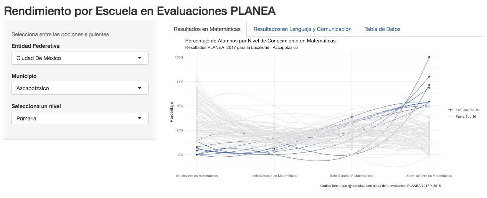

## Todo empezó con una pregunta

Hace algunos meses algunos padres de familia pedimos una reunión con la maestra titular de una de mis hijas para platicar sobre algunos temas, referentes al desempeño escolar, que nos tenían preocupados. Si bien en algún momento se tocaron temas como la importancia, o no, del factor social en la educación, el valor de la reglas o la cantidad de tareas que se dejaban; lo que más me dejó intrigado fue la aseveración sobre la caída del nivel académico del colegio. Cuando pregunté acerca de los datos que respaldaban tal creencia resultó que no habían. O al menos eso creí. 

## Las pruebas PLANEA y ENLACE

Durante los años 2006 al 2013 en México se aplicó la prueba estandarizada ENLACE (Examenes Nacionales del Logro Académico en Centros Escolares) a todos los niños desde tercero de primaria hasta tercero de secundaria. Estas pruebas llevaban consigo algunos vicios y virtudes que fueron determinantes para que en 2015 se aplicara la nueva prueba PLANEA (Plan Nacional para la Evaluación de los Aprendizajes) que sustituía a la ENLACE. La PLANEA sólo se aplica, en educación básica, a niños de 6º de primaria y 3º de secundaria y según la SEP [^1] tiene las siguientes intenciones:

- *Informar a la sociedad sobre el estado que guarda la educación del país en términos del logro de aprendizaje de sus estudiantes de educación básica y media superior.*
- *Aportar a las autoridades educativas información relevante para el monitoreo, la planeación, programación y operación del sistema educativo y de sus centros escolares.*
- *Ofrecer información pertinente, oportuna y contextualizada a las escuelas y a los docentes, que ayude a mejorar sus prácticas de enseñanza y el aprendizaje de sus estudiantes.*
- *Contribuir al desarrollo de directrices para la mejora educativa con información relevante sobre los resultados educativos y los contextos en que tienen lugar.*

La misma SEP alienta[^2] a los padres de familia a usar los resultados de esta prueba para intentar responder las siguientes preguntas:

- *¿Qué apoyos podemos ofrecer para que los estudiantes logren los aprendizajes clave?*
- *¿Qué le hace falta a la escuela?*
- *¿Cómo podemos colaborar con la escuela?*

Las áreas que evalua son **Matemáticas** y **Lenguaje Y Comunicación**. En cada rubro se aplican 46 preguntas, dando un total de 92 reactivos, y los resultados de las pruebas agrupan a los alumnos en cuatro categorías:

- Con conocimiento **Insuficiente**
- Con conocimiento **Indispensable**
- Con conocimiento **Satisfactorio**
- Con conocimiento **Sobresaliente**

## Revisando el desempeño

Si se pregunta porqué como padre debería importarle este tipo de evaluaciones, podría mencionar el estudio[^3] del 2011 que sugiere que un mejor maestro de preescolar conlleva una mayor probabilidad de terminar la universidad  y de tener mayores ingresos a los 27 años, o el del 2014[^4], que indica que un docente con mayor "valor agregado" en cuarto de primaria aumenta, en promedio, el ingreso futuro del estudiante en alrededor de 39,000 dólares durante su vida adulta. Si bien estos estudios se llevaron a cabo en Estados Unidos, nos pueden dar una idea de la importancia de una buena educación desde edades tempranas.

Los resultados de las pruebas PLANEA se pueden encontrar en la página de la SEP[^5], donde se pueden consultar resultados por escuela o hasta por alumno, o también en portales como [Mejora Tu Escuela](http://www.mejoratuescuela.org/) que incluso crea un ranking y tiene herramientas para comparar por escuela.

Sin embargo, esas herramientas no me dejaban ver gráficamente el desempeño del colegio respecto a los demás en el municipio. O si este se comporta mejor respecto a otros en el estado.

Es por esto que decidí construir una aplicación que me permitiera ver el desempeño de todas las escuelas de una manera diferente.

## ¿Cómo funciona la aplicación?

Esta se encuentra en el siguiente enlace:

https://nerudista.shinyapps.io/Planea_resultados/

Una vez dentro hay tres opciones que se deben escoger:

- Entidad Federativa
- Municipio
- Nivel (Primaria o Secundaria)

## ¿Cómo usar la aplicación?

---------------------------------------------
[^1]: http://planea.sep.gob.mx/content/general/docs/2015/PlaneaFasciculo_1.pdf
[^2]: http://planea.sep.gob.mx/content/general/docs/2015/PlaneaFasciculo_4.pdf
[^3]: https://www.nber.org/papers/w16381
[^4]: https://www.nber.org/papers/w19424
[^5]: http://www.mejoratuescuela.org/